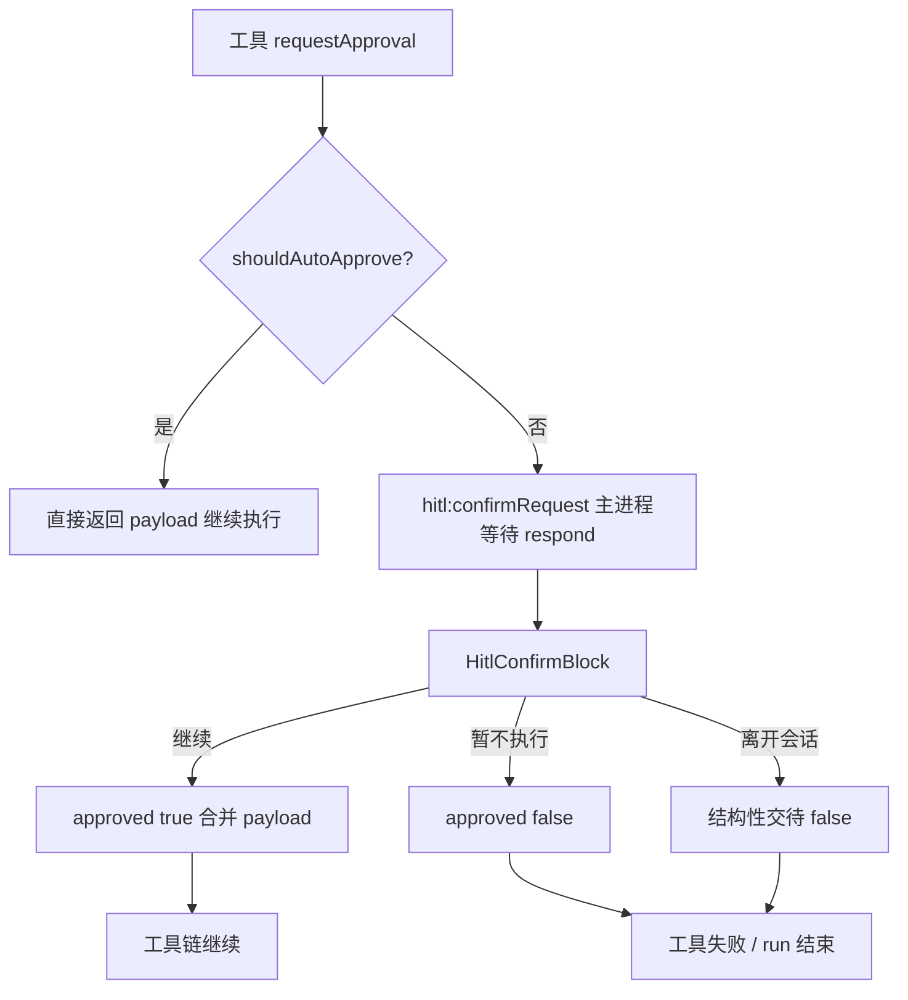

# HITL 最终形态方案

> 日期：2026-05-04  
> 范围：人工确认（Human-in-the-Loop）交互、持久化、恢复与相关协议。  
> 原则：**不保留**「倒计时结束自动取消」等旧语义；以本文为准一次性收敛实现。

---

## 0. 导读与全链路一览

### 0.1 一句话

**未自动通过的操作**在单会话内**最多挂起一条**人工确认；用户以**「继续」**为主路径无限期等待；**无倒计时、无自动拒绝**；离开会话由系统做**结构性交待**（`approved: false`）；重启后的未决块为 **Stale**，先过渡期指引、再由阶段 C 一键恢复。

### 0.2 已拍板决策速查

| 维度 | 结论 |
|------|------|
| 倒计时 | 删除，不作为产品概念 |
| 用户主路径 | 「继续」+ 可选补充说明（**方案 A**，仍 `approved: true`） |
| 不执行本次 | 低打扰「暂不执行本次」→ `approved: false` + `reason` |
| 并发 HITL | **禁止**；第二次 `requestApproval` **抛错** |
| 历史旧 `hitlBlock` | **只读**；`approved` → `status` 映射 |
| Stale 过渡期 | **显式提示 + 指引**；禁止静默失败（见 §3.1 与 §6.3 输入框规则） |
| 阶段 C | 一键恢复（如 `agent:resumeHitl`）替代过渡期 |

### 0.3 主流程（从工具调用到结束）



> **Stale**（有 `pending` 消息但无主进程等待）不经过 `W` 的等待环，见 §6；过渡期由用户发消息或阶段 C 一键恢复。

### 0.4 `hitl:respond` 来源归纳

| `approved` | 触发来源 | 用户感知 |
|------------|----------|----------|
| `true` | 点「继续」 | 主路径 |
| `false` | 「暂不执行本次」 | 弱入口 |
| `false` | 回首页 / 切会话 / 退出（尽力） | 离开即中断，文案不强调「点取消」 |

### 0.5 Live vs Stale（输入框与真源）

| 状态 | 主进程是否在等 `respond` | 聊天输入框 | 真源 |
|------|--------------------------|------------|------|
| **Live pending** | 是 | **禁用**（须先处理确认块） | `pendingHitlRequest` + 可选 `messages` 中同条 `pending` |
| **Stale pending** | 否 | **允许**（过渡期需发一句恢复时；阶段 C 一键后可视情况再定） | `messages` 中 `status: 'pending'` |

> **说明**：§3.1「禁止发消息」仅约束 **Live**；与 §6.3 过渡期「请发一句继续」针对 **Stale** 不矛盾。

---

## 1. 目标与非目标

### 1.1 目标

1. **人工 HITL**：进入后**无限期等待**，直至用户在主界面完成**「继续执行」**（`approved: true`）。无可编辑内容时为只读确认；有可编辑内容时为可编辑页，编辑结果随「继续」一并提交。**不把「点按钮拒绝」当作常态用户路径**（见 3.1、3.4）。
2. **策略分层不变**：`auto` / `allowlist` / `strict` 与 `shouldAutoApprove` 行为不变；**未**命中自动通过时才出现人工确认 UI。
3. **单一确认面**：聊天区内 **一块** `HitlConfirmBlock` 为权威 UI；禁止第二套全局弹窗与主流程并行抢答。
4. **会话内状态可恢复**：同一会话内，待确认态与编辑草稿写入会话存档；**重载渲染进程、从历史进入同一会话**时仍能继续编辑并提交（在「后端仍在等待」或「按恢复链路重入」两种情形下见第 6 节）。
5. **行为可解释**：**继续**与**结构性交待**（离开会话、切会话等触发的 `approved: false`）在实现与日志上可区分；不在文案里强调「请点取消」。

### 1.2 非目标

- 不在本文规定各 `actionType` 的字段级校验细节（沿用现有 `HitlConfirmBlock` 分支）。
- 不引入「服务端 HITL 硬超时」（后端继续**仅**依赖 `hitl:respond`）。

---

## 2. 概念与术语

| 术语 | 含义 |
|------|------|
| **人工 HITL** | 未自动通过、需展示确认 UI 的一次 `requestApproval`。 |
| **Live pending** | 主进程已为该 `requestId` 注册 `hitl:respond` 等待；用户「继续」或系统性交待（见 3.4）可 `invoke` 结束等待。 |
| **Stale pending** | 会话消息里存在 `status: 'pending'` 的 HITL 记录，但当前无对应等待（例如重启、runtime 已销毁）。继续需走 **恢复链路**（第 6.3）。 |
| **草稿** | 用户在可编辑 HITL 上修改、尚未通过「继续」提交到后端的增量，持久化在消息的 `draftEdits`（或等价字段）。 |

---

## 3. 交互规范（最终形态）

### 3.1 主界面（`HitlConfirmBlock`）——以「继续」为唯一主路径

- **不再展示**「N 秒内确认 / 剩余时间」及任何**自动**因时间触发的拒绝。
- **主按钮（唯一强呈现）**：「继续执行」（或 payload 内 `confirmText`），提交 `approved: true` + 若有则 `payload` 为编辑合并结果（与现逻辑一致）。
- **补充说明与 VL（已拍板：方案 A）**：与「继续」同屏提供**可选**说明输入（如「补充要求 / 修改说明」）。用户填写后仍只点**继续**；`respond` 一律为 `approved: true`，说明内容按各 `actionType` **并入 `response.payload`**（或该类型既有字段，如 VL 的 user prompt），**不得**要求用户为写说明而去点「拒绝」。若某类型历史上把说明绑在「取消 + reason」上，实现上迁移为「继续 + payload 字段」。
- **不把「取消执行」作为与「继续」并列的主按钮**：真实用户几乎不会主动做「显式拒绝」；界面上避免用大号次要按钮引导「取消」。若仍需「不执行本次并说明」，使用**低打扰入口**（文案示例：「暂不执行本次」），点击后 `approved: false` + `reason`；与方案 A 的补充说明分流：**继续 = 仍执行并带说明；暂不执行 = 不执行**。
- **「加入自动通过列表」**：仅将 `actionType` 写入配置；**不结束当前条** HITL。副文案固定为：**「仅影响后续同类操作，本次仍需确认。」**
- **待确认期间 — 输入框（区分 Live / Stale，与 §0.5 一致）**：
  - **Live pending**（主进程正在等待本次 `respond`）：主聊天**输入框禁止发送**（禁用或拦截并提示「请先完成上方确认」）。**禁止**「发消息即隐式取消当前 HITL」的旧行为。
  - **Stale pending**（仅消息里有未决块、无主进程等待）：**允许**发送，用于 §6.3 过渡期指引用户发简短恢复语；阶段 C 一键恢复若不再需要输入框，可再收紧 UX。


### 3.2 与 `allowlist` / `auto` 的关系

- 与倒计时**无关**：allowlist 命中则**根本不弹**人工 HITL；弹了则**没有时间驱动的自动取消**。

### 3.3 切会话 / 返回首页

| 操作 | 期望行为 |
|------|----------|
| 用户点击主按钮「继续执行」 | `respond` `approved: true`（+ 可选编辑 `payload`）。 |
| 用户通过 3.1 的**低打扰入口**「暂不执行本次」 | `respond` `approved: false` + 可选 `reason`（与「继续 + 补充说明」无关）。 |
| 用户返回首页 / `resetSession` | 若存在 Live pending：先 `respond` `approved: false`，`reason` 见 3.4（**结构性交待**）。 |
| 用户切换到**另一会话** | 在关闭旧会话 runtime 之前：若旧会话存在 Live pending，**必须**先 `respond` `approved: false`（`reason` 见 3.4）；再 `closeRuntime` / `loadSession`。 |
| 用户切换到**同一会话**的重新加载 | 仅从磁盘恢复消息与 pending 状态，不主动 `respond`。 |

### 3.4 结构性交待（`approved: false`，非用户主路径）

以下情况**仍需**向主进程 `hitl:respond` 发送 `approved: false`，以释放工具等待、避免悬挂；语义是**用户未完成确认即离开**，不是「用户主动点取消」：

| 场景 | `reason` 建议（示例） |
|------|------------------------|
| 返回首页 / `resetSession` | `用户返回首页` / `Cancelled by navigation`（与实现统一一种） |
| 切换到另一会话 | `会话已切换` |
| 应用退出（尽力而为） | `应用退出` |
| Stale 仅本地收尾（见 6.3） | 不调用 `respond`，仅本地 `status` |

实现上**必须有**这些路径；**产品上不必**向用户强调「请先点取消」，而应表述为「离开当前会话将中断未完成的步骤」（若需提示）。

---

## 4. 数据模型

### 4.1 消息上的 HITL 记录（替换原 `HitlBlockRecord` 单一形态）

统一为**一种**结构（新会话/新产生的记录均使用；旧存档若仅有 `approved: boolean` 可在读取时映射为 `status`，仅用于只读展示历史，**不**再写入该旧形）：

```ts
/** 聊天消息内嵌的 HITL 状态，用于展示与持久化 */
export interface HitlBlockRecord {
  requestId: string;
  actionType: string;
  /** 工具调用原始入参（与后端发起 HITL 时一致） */
  payload: Record<string, unknown>;
  status: 'pending' | 'approved' | 'rejected';
  /** 用户编辑增量；Continue 时与 payload 按现有各 action 规则合并 */
  draftEdits?: Record<string, unknown>;
  /** rejected 时可选，与现 reason 一致 */
  reason?: string;
  /** 决议时间（可选，便于审计） */
  resolvedAt?: string;
}
```

- **`pending`**：展示完整确认 UI（含编辑区、可选补充说明）；允许更新 `draftEdits` 并 debounce 写入会话。
- **`approved` / `rejected`**：展示为只读结果；文案上优先用「已继续」与「未继续 / 已中断」（避免强调「用户取消」）；`rejected` 含结构性交待与用户主动「暂不执行」两种来源时，可在日志用 `reason` 区分。

### 4.1.1 历史旧形 `hitlBlock`（已拍板）

- 仅存 `approved: boolean`、无 `status` 的存档：**只读展示**，不参与 pending 恢复、不提供编辑。
- 读取时映射：`approved === true` → 视为 `approved`；`approved === false` → 视为 `rejected`。不向磁盘写回旧形。
- **新写入**一律使用 §4.1 的完整结构（含 `status`）。

### 4.1.2 唯一 pending（已拍板：策略 1 — 禁止并发）

- **会话维度**：至多 **一条** `hitlBlock.status === 'pending'` 且至多 **一个** Live `hitl:respond` 等待。
- **若**在同一 `sessionId` 上，前一次 `requestApproval` 尚未收到 `hitl:respond`，**再次**调用 `requestApproval`：**必须失败**（抛错，工具/调用方感知）；**不**排队、**不**自动合并为一条。由 agent/工具层避免并行触发多个人工 HITL。
- 渲染进程若异常收到第二次 `hitl:confirmRequest`：应拒绝覆盖或报错提示，**不**产生第二条 pending 消息（实现细节任选一种，与后端「单飞」一致）。

### 4.2 渲染进程运行时状态

- `pendingHitlRequest` 可收敛为与 `HitlBlockRecord` 的 `pending` 行同步：收到 `hitl:confirmRequest` 时**同时**在 `messages` 末尾（或替换占位）写入一条 `hitlBlock` 且 `status: 'pending'`，并以该对象为 UI 真源；避免「仅内存一份、不落盘」导致刷新丢失。
- 自动保存：沿用现有 `session.update({ messages, todos })`；**待确认与草稿随 messages 持久化**。

### 4.3 删除「超时」作为产品概念

- **`hitl-config.ts`**：删除 `timeouts` 配置块及 `getTimeout`；`HITLRequest` 日志结构中的 `timeout` 字段改为**不再使用**或固定 `0`，避免与「无限等待」矛盾。
- **IPC `hitl:confirmRequest` 载荷**：**移除** `timeout` 字段（`preload` 类型与监听器一并更新）。
- **后端注释**：删除「超时由前端倒计时控制」等表述，改为「仅当前端 `hitl:respond` 时结束等待」。

---

## 5. 后端与 IPC（最终形态）

1. **`HITLService.requestApproval`**：`sendConfirmationRequest` 发往渲染进程的 payload **不再含** `timeout`；若当前会话已存在未完成的 `requestApproval` 等待（未 `respond`），**须立即抛错**，不注册第二个等待（与 §4.1.2 一致）。
2. **`hitl:respond`**：唯一完成 Live pending 的通道；语义不变。
3. **日志 / `HITLRequest` 类型**：可保留字段位但固定为 `0` 或删字段（二选一，实现时选删字段需同步 LogManager 序列化）。

---

## 6. 恢复链路（Stale pending）

### 6.1 问题

进程重启或 runtime 销毁后，**不存在**可对旧 `requestId` 调用的 `hitl:respond` 等待。

### 6.2 会话内真源

以 **`messages` 中最后一条 `hitlBlock.status === 'pending'`**（或约定唯一 pending）为待办 HITL；`draftEdits` 为用户最新草稿。

### 6.3 「继续」在 Stale 下的行为

1. 用户点击「继续执行」：
   - **Live pending**（本进程曾收到 `hitl:confirmRequest` 且未 `respond`）：`respond` + `approved: true` + `payload`（含补充说明合并结果）。
   - **Stale pending**（消息里仍有 `status: 'pending'`，但无主进程等待）：**禁止**对旧 `requestId` 调用 `hitl:respond`。
     - **阶段 C 已落地**：调用应用层恢复用例（如 `agent:resumeHitl` 或与 checkpoint 对齐的 invoke），传入 `sessionId`、合并后的 `mergedPayload`、`actionType` 等，完成一键继续。
     - **阶段 C 未落地（已拍板：过渡期由实现侧采用显式失败 + 指引）**：点击「继续」时展示**明确错误或非阻塞提示**（例如 toast / 块内说明）：当前无法从离线状态自动完成该步；请用户在本会话**输入框发送一条简短说明**（如「继续上一步确认」），依赖既有 checkpoint + `invoke-agent-use-case` 语义由 agent 再次走到 HITL 或等价路径。**不得**静默无反馈、不得假装已成功 `respond`。

2. 用户选择「暂不执行本次」（Stale，若 UI 提供）：仅更新本地消息 `status: 'rejected'` 并持久化；**不**调用 `hitl:respond`。

**验收**：阶段 C 完成后，Stale「继续」应以一键恢复替代过渡期文案；过渡期行为以「有清晰指引、无静默失败」为最低合格线。

---

## 7. 前端组件清理

1. **`HitlConfirmBlock`**：删除倒计时相关逻辑；主 CTA「继续」；**可选补充说明**与继续同屏（方案 A）；`onCancel` 仅绑定「暂不执行本次」低打扰入口（若保留）；结构性交待仍由父级/导航处理。
2. **`ConfirmDialog.tsx`**：**删除文件**及任何引用（当前未挂载则直接删文件防未来重复 UI）。
3. **`ChatInterface`**：`handleSubmit` 去掉「有 pending 则先 false respond 再发消息」；改为 **pending 时阻止发送** 并提示。
4. **`ChatProvider.loadSession`**：从加载的 `messages` 恢复 **最多一条** pending 到协作状态（或与消息列表完全由 `hitlBlock` 驱动，避免双真源）；切会话时按 3.3 先拒绝 Live pending。

---

## 8. 实现阶段建议（同一方向下的拆分顺序）

| 阶段 | 内容 |
|------|------|
| A | 去掉倒计时与 IPC `timeout`；配置删除 `timeouts`；文案与注释统一为无限等待。 |
| B | pending 写入 `messages` + 草稿 debounce；禁止待确认时发消息；切会话先 respond false。 |
| C | Stale「继续」恢复用例 + IPC（与 checkpoint 对齐）；验收重启与同会话重进。 |

阶段 C 可与 A/B 同 PR 若人力允许；**最低可合并集**为 A+B（同进程内体验完整），C 为重启/恢复闭环。

---

## 9. 测试清单（验收）

1. 人工 HITL 弹出后长时间无操作：**不**自动取消；仍可编辑（若该类型可编辑）并最终「继续执行」成功。
2. 待确认时输入框发送：**被拦截**，且不会隐式 `respond false`。
3. allowlist 命中：仍无弹窗，工具直接执行。
4. 「加入自动通过列表」：当前条仍待确认；下次同类操作在 allowlist 模式下自动通过。
5. 切换会话：旧会话 Live pending 收到 `approved: false`（结构性交待），无悬挂等待。
6. （阶段 C）保存 pending + 草稿后重启应用、进入同一会话：仍见同一块待确认，继续后工具收到合并 payload。
7. 并发：会话已有一条 pending 时再次触发 `requestApproval`：后端抛错，不出现第二条 pending。
8. 过渡期：Stale 点「继续」须有明确提示或指引，不得静默失败。
9. 旧 `hitlBlock`（仅 `approved`）：只读展示，不可编辑。

---

## 10. 破坏性变更摘要

- 移除所有「前端倒计时触发取消」代码路径。
- IPC `hitl:confirmRequest` 载荷字段变更（删 `timeout`）。
- `hitl-config` 删除 `timeouts` / `getTimeout`。
- `HitlBlockRecord` 形态变更；历史消息读取可做最小只读映射，**新写入**仅用新结构。
- 删除 `ConfirmDialog`。
- 聊天发送与 pending 的语义变更（不再隐式取消）。

---

## 11. 与 DDD / 分层

- 恢复用例放在 `backend/application/`（纯函数 + 注入），由 `electron/ipc` 或 `services` 调用；**不在**渲染进程直接操作 checkpoint 文件。
- Tools 仍仅通过 `HITLService.requestApproval` 触发确认，不绕过端口。

---

## 12. 评审复盘（风险与演进）

**核心结论与已拍板表见 §0.2；全链路见 §0.3～0.5。** 本节仅保留风险与版本差异。

### 12.1 风险与缓解

- **用户不知离开会中断**：若在 HITL 展示期切会话，工具会失败；可在切会话确认弹窗中一句说明（产品可选）。
- **禁止并发 HITL**：agent 若并行触发多工具确认，第二个会失败；需在编排侧串行化或避免多个人工 HITL 重叠。
- **Stale 过渡期**：用户需按指引发一句消息才能续跑，体验弱于阶段 C；以清晰文案降低困惑。
- **Live / Stale 输入框规则不同**：实现时须按 §0.5 分支，避免 Stale 仍锁死输入框导致过渡期不可用。

### 12.2 相对初版 spec 的修正点

- 去掉倒计时与「时间到自动取消」；**继续为主路径**；`approved: false` 以**结构性交待** + **暂不执行**弱入口为主。
- 明确 **Live / Stale** 与 **输入框**、**`respond`** 的边界，避免语义自相矛盾。

---

*本文档通过后，实现可对应单一或分阶段 PR；无需再兼容「倒计时自动取消」语义。*
