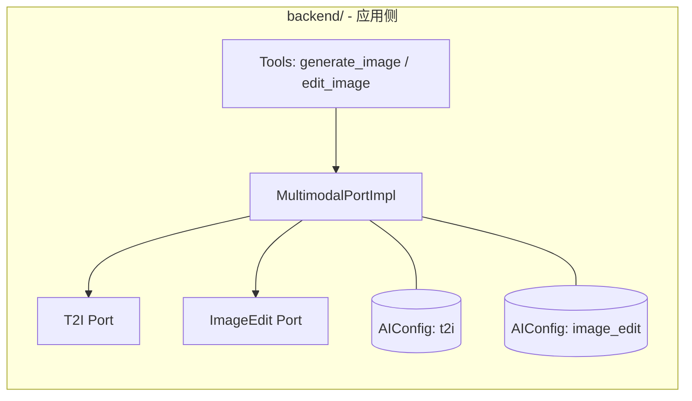
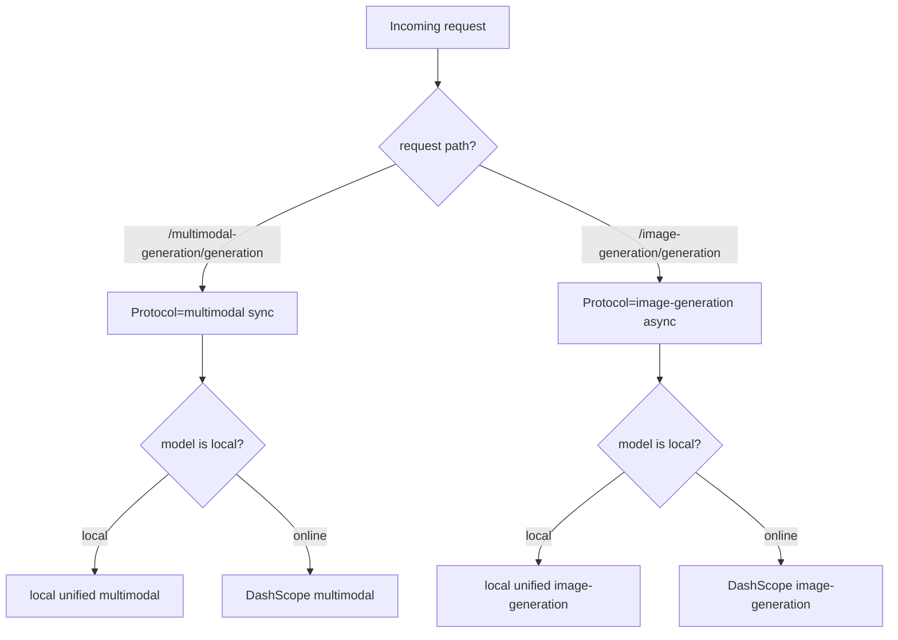

# 图像能力配置与路由对齐（DashScope ⇄ jiaojiao-gateway）设计规格

日期：2026-04-26  
状态：Draft（待 Review）  
范围：**图像文生图（T2I）** 与 **图像编辑（Image Edit）** 的配置拆分、接口对齐、网关路由对齐与迁移策略。

---

## 背景与问题陈述

当前项目在多模态配置与路由上存在“能力语义”与“HTTP 接口协议族”混淆：

- `ai_models.json` 仅有 `t2i` 一块配置，但运行时同时承载 **文生图**（`generate_image`）与 **图像编辑**（`edit_image`）两条链路。
- DashScope 官方 2026 文档中：
  - Qwen-Image（文生图）与 Qwen-Image-Edit（图像编辑）**推荐/主要**通过 `multimodal-generation/generation`（同步）调用；
  - 万相 `wan2.6-t2i` 属于 `image-generation/generation` + `/tasks/{task_id}` 的**异步任务**体系。
- jiaojiao-gateway 当前实现按 `adapter_type` 将在线 `text_to_image` / `image_edit` 固定转发到 `image-generation/generation`，导致 Qwen-Image/Qwen-Image-Edit 与 DashScope 官方接口不一致，出现 400（例如 image-edit 要求 1~3 张 image，但文生图请求没有 image）。

本设计的目标是：**让 DashScope 直连与 jiaojiao-gateway 在“图像接口层面”无缝切换**，并在配置层清晰区分 `t2i` 与 `image_edit`。

---

## 目标与非目标

### 目标（Goals）

- **G1**：`ai_models.json` 中区分 `t2i`（文生图）与 `image_edit`（图像编辑）两种能力块。
- **G2**：对齐 DashScope 在线接口族：
  - Qwen-Image 系列（文生图）：`multimodal-generation/generation`（同步）
  - Qwen-Image-Edit 系列（图像编辑）：`multimodal-generation/generation`（同步）
  - wan2.6-t2i（文生图）：`image-generation/generation` + `/tasks/{task_id}`（异步任务）
- **G3**：jiaojiao-gateway 对齐 DashScope 在线接口：**对外暴露两条路由**（`image-generation` 与 `multimodal-generation`），路由内部再统一/分流。
- **G4**：执行顺序与交付物明确：先写方案文档 → 对齐 docs 接口文档 → 再按（配置拆分、DashScope 对齐、网关对齐）实施。

### 非目标（Non-goals）

- 不在本阶段决定所有 Qwen-Image 具体型号（如 `qwen-image-2.0-*`）的默认选型细节，仅定义“模型族与协议族”的对齐原则。
- 不在本阶段重构前端 UI 或 Agent 交互，仅保证工具链路可正确调用并可切换 provider。

---

## 术语与能力定义

- **T2I（文生图）**：输入仅文本 prompt，输出图片。
- **Image Edit（图像编辑）**：输入 1~3 张图片 + 文本指令，输出图片（可多张）。
- **协议族（Protocol family）**：
  - **multimodal-generation（同步）**：`POST /api/v1/services/aigc/multimodal-generation/generation`
  - **image-generation（异步任务）**：`POST /api/v1/services/aigc/image-generation/generation` + `GET /api/v1/tasks/{task_id}`

---

## 约束与原则（必须满足）

1. **Provider 只分两类**  
   - LLM 使用 `agent.provider`
   - 多模态（VL/TTS/T2I/ImageEdit）统一使用 `agent.multimodalProvider`
2. **能力配置不互相污染**  
   - 文生图默认模型/endpoint 不得被图像编辑默认模型/endpoint 影响，反之亦然。
3. **网关对外路由清晰**  
   - 对外暴露两条路径（A 方案）：`image-generation` 与 `multimodal-generation`。
4. **DashScope ⇄ Gateway 可无缝切换**  
   - App 端只需要切换 `multimodalProvider=dashscope|jiaojiao`，无需改工具或业务代码即可在接口层面一致工作。
5. **先抽象后实现（同步/异步任务）**  
   - 在实现任何“同步 multimodal 调用”和“异步 task 调用”之前，必须先检查当前代码库是否已有对应抽象（例如同步/异步端口基类）。  
   - 若缺少抽象：先定义清晰的抽象基类/接口（例如 `SyncInferenceBase` / `AsyncInferenceBase` 及其统一错误处理与返回形状），再在 adapter 中继承实现具体 provider 的 HTTP 调用。  
   - 禁止直接在业务工具或 `MultimodalPortImpl` 中堆叠 provider 分支逻辑；协议差异应被适配器层消化。

---

## 设计总览（架构与数据流）

### 能力拆分与注入（App 后端）

关键点：`MultimodalPortImpl` 不再只注入一个 `t2iCfg`，而是注入 **两份配置**：`t2iCfg` 与 `imageEditCfg`。

---

## 配置设计：ai_models.json 的 schema 变更

### 新能力键：`image_edit`

领域层扩展 `AIAbility`：

- 现状：`'llm' | 'vl' | 'tts' | 't2i'`
- 目标：`'llm' | 'vl' | 'tts' | 't2i' | 'image_edit'`

`ai_models.json`（provider -> ability）增加：

- `dashscope.image_edit`
- `jiaojiao.image_edit`
- （如需）`zhipu.image_edit`（目前智谱也有 image-edit 适配器，可按同样模式纳入）

### 配置字段规则

- `t2i`：
  - `endpoint`: 默认指向 **multimodal-generation/generation**（同步，Qwen-Image 系）
  - 可选提供 `legacyEndpoint`/`taskEndpoint` 组合给 `wan2.6-t2i`（若仍要在同能力内支持异步）
  - `default`: `qwen-image*`
- `image_edit`：
  - `endpoint`: **multimodal-generation/generation**
  - `default`: `qwen-image-edit-max*`

> 注：如果希望严格把 “wan2.6-t2i” 完全独立出来，也可以新增 `t2i_async` 能力；本设计先不引入第三个键，优先通过模型族选择在 `t2i` 内部区分同步/异步协议族（见后文“协议选择策略”）。

---

## DashScope 在线接口对齐（协议矩阵）

### 模型族 → 协议族映射（权威规则）

| 模型族 | 典型模型名（示例） | 能力语义 | DashScope 推荐/主路径 | 同步/异步 | 关键入参约束 |
|---|---|---|---|---|---|
| Qwen-Image | `qwen-image`、`qwen-image-2.0-*` | 文生图 | `multimodal-generation/generation` | 同步 | `content` 仅 1 个 `{text}` |
| Qwen-Image-Edit | `qwen-image-edit`、`qwen-image-edit-max*` | 图像编辑 | `multimodal-generation/generation` | 同步 | `content` 必须含 1~3 `{image}` + 且仅 1 个 `{text}` |
| Wan（万相） | `wan2.6-t2i` | 文生图（任务式） | `image-generation/generation` + `/tasks` | 异步 | 提交需 `X-DashScope-Async: enable`，轮询 `/tasks/{task_id}` |

### 参数与响应一致性要求

- 同步 multimodal 返回：解析 `output.choices[0].message.content[].image`
- 异步任务返回：提交拿 `output.task_id`，轮询成功后解析图片 URL（或 results.url）

---

## jiaojiao-gateway 设计：对外暴露两条路由（A 方案）

### 对外接口（外部契约）

- `POST /api/v1/services/aigc/multimodal-generation/generation`
  - 支持：Qwen-Image（文生图）+ Qwen-Image-Edit（图像编辑）+（可选）TTS/VL
  - 行为：对外 **与 DashScope 保持一致的请求/响应结构**（同步返回图片 URL）

- `POST /api/v1/services/aigc/image-generation/generation`
  - 支持：Wan 系任务式文生图（如 `wan2.6-t2i`）
  - 行为：保持任务式提交 + `/tasks` 查询协议

- `GET /api/v1/tasks/{task_id}`
  - 行为：按任务前缀路由本地（如 `qi_` / `qe_`）与在线（DashScope）

### 网关内部路由策略（推荐）

网关内部不再用 “adapter_type → 固定 path” 的方式做 online 转发，而是按 **模型族/协议族** 决定 upstream path：

> 说明：本设计允许本地 unified 只实现一部分协议族；如果本地统一服务只提供 image-generation 风格接口，那么 gateway 在本地侧也需要做协议适配（将 multimodal 请求转换为统一服务可理解的请求）。这属于“路由内部统一”的职责。

---

## App ⇄ Gateway 无缝切换的保证

### 目标

App 端（backend）在 `multimodalProvider=dashscope|jiaojiao` 两种模式下：

- `t2i`（Qwen-Image 默认）走 `multimodal-generation/generation`
- `image_edit`（Qwen-Image-Edit 默认）走 `multimodal-generation/generation`
- 若用户显式选 `wan2.6-t2i`：走 `image-generation/generation` + `/tasks`

### 必要条件

- `ai-config.getAIConfig()` 必须能分别返回：
  - `getAIConfig('t2i')`：包含 multimodal endpoint（用于 Qwen-Image 同步）
  - `getAIConfig('image_edit')`：包含 multimodal endpoint（用于 Qwen-Image-Edit 同步）
- 当 provider 为 `jiaojiao` 时，上述 endpoint 必须指向 gateway 对应的两条公开路由。

---

## 协议选择策略（实现指导，不是代码）

### 文生图（t2i）

1. 默认模型为 `qwen-image*` → 使用 `multimodal-generation/generation`（同步）
2. 若显式指定模型为 `wan2.6-t2i`（或配置中标记为 async-task 协议族）→ 使用 `image-generation/generation` + `/tasks`（异步）

### 图像编辑（image_edit）

1. 默认模型为 `qwen-image-edit-max*` → 使用 `multimodal-generation/generation`（同步）
2. 若显式指定 legacy `wan2.6-image`（可选）→ 允许走异步或同步，按官方/网关实现能力决定

---

## 迁移策略

### 阶段 0：设计与文档对齐（本任务要求）

1. 写本设计文档（本文件）
2. 更新/补齐 `docs/third-party-api/` 的接口文档：
   - `dashscope-api.md`：加入 Qwen-Image/Qwen-Image-Edit 的推荐路径与入参约束，明确与 wan2.6-t2i 的差异
   - `百炼万象2.6的图片编辑api.md`：标注其协议族与是否任务式
3. （仅写方案，不在本仓库实现）输出 **G3 网关改造方案文档**，供 `jiaojiao-gateway` 仓库落地实现：
   - 落盘路径（本仓库）：`docs/superpowers/specs/2026-04-26-jiaojiao-gateway-image-routing-design.md`
   - 文档应包含：对外两路由契约、online/local 分流策略、与 DashScope upstream 的对齐表、兼容策略（历史客户端）、以及测试清单
4. 对齐并更新 `deploy/jiaojiao-gateway/docs/api.md`（文档层面对齐即可）：明确对外两条路由，并写清模型族映射策略与兼容策略（具体代码实现由网关仓库完成）

### 阶段 1：配置拆分与类型升级

- `AIAbility` 增加 `image_edit`
- `ai_models.json` 增加 `image_edit` block
- `getAIConfig()` 支持 `image_edit`

### 阶段 2：DashScope 适配器对齐（App 侧）

- `t2i` 适配器支持 Qwen-Image 的同步 multimodal 调用
- `image_edit` 适配器支持 Qwen-Image-Edit 的同步 multimodal 调用（现有基本满足，但配置来源需改为 `image_edit`）
- `wan2.6-t2i` 维持现有异步任务实现
- **验证门禁**：完成 G2 后必须运行单元测试与集成测试；集成测试需调用真实 API，且 `qwen-image` 与 `qwen-image-edit*` 均能拿到真实输出图片 URL 后，G2 才算完成。

### 阶段 3：Gateway 路由对齐

- 对外暴露两条路由（multimodal / image-generation）
- online 转发按协议族走正确 upstream path
- local unified 若不支持 multimodal，则在 gateway 内做协议转换（“路由内部统一”）

---

## 测试与验收

### 单元/集成测试建议

- `getAIConfig()`：
  - 能分别返回 `t2i` 与 `image_edit` 的 endpoint/model/taskEndpoint
- 文生图：
  - `qwen-image*`：走同步 multimodal，响应含 image URL
  - `wan2.6-t2i`：走异步 tasks，能拿到 task_id 并轮询成功
- 图像编辑：
  - `qwen-image-edit-max*`：请求必须包含 1~3 image，响应含 image URL
- Gateway：
  - `/multimodal-generation/generation` 与 `/image-generation/generation` 皆可在 local/online 配置下工作
  - provider 切换（dashscope ⇄ jiaojiao）不改业务参数即可通过

### 真实 API 集成测试门禁（G2 完成条件）

- 必须包含两条“真实结果”验证：
  - **T2I（Qwen-Image）**：能成功返回可下载的真实图片 URL
  - **Image Edit（Qwen-Image-Edit）**：能成功返回可下载的真实图片 URL（输入需包含 1~3 张图片）
- 仅当上述两条在集成测试中稳定通过（允许按供应商限流做退避/重试，但不能靠手工跳过）时，才允许宣布 G2 完成并进入 G3。

### 验收标准（Definition of Done for implementation）

- 配置层：`ai_models.json` 分离 `t2i` 与 `image_edit`，并在运行时被分别使用
- 协议层：Qwen-Image / Qwen-Image-Edit 走 `multimodal-generation`；wan2.6-t2i 走 `image-generation + tasks`
- 网关层：对外两路由，且 online 转发路径正确

---

## 风险与对策

- **R1：本地 unified 服务只支持一种协议形态**  
  - 对策：gateway 内做协议转换（multimodal ⇄ image-generation），并在 docs 明确转换规则。
- **R2：Qwen-Image 的异步接口与现有异步抽象冲突**  
  - 对策：默认走同步 multimodal；异步仅作为可选扩展，避免与 wan2.6-t2i 混淆。
- **R3：历史配置/测试断言依赖旧 default model**  
  - 对策：分阶段迁移，先改 schema 与测试，再改默认模型与端口选择。

